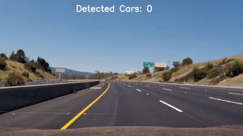

# **Self-Driving Car Engineer - Nanodegree** 
## ---Computer Vision---
# Vehicle Detection

---
[//]: # (Image References)

[image1]: ./output_images/HOG_Car.jpg "Car Example for HOG Feature"
[image2]: ./output_images/HOG_NonCar.jpg "Non-Car Example for HOG Feature"
[image3]: ./output_images/OriginalCarNonCar.jpg "Example for car and non-car image"
[image4]: ./output_images/MS_Windows.jpg "Multi-scaling windows"
[image5]: ./output_images/AllDetection.jpg "Road Image with all bounding boxes"
[image6]: ./output_images/NoFalseOrMultiple.jpg "False Positives and Multiple Detections"
[image7]: ./output_images/FinalCarDetection.jpg "Result image of vehicle detection"
[image8]: ./output_images/FirstMSW.jpg "First Multi-Scale Window"
[image9]: ./output_images/SecondMSW.jpg "Second Multi-Scale Window"
[image10]: ./output_images/ThirdMSW.jpg "Third Multi-Scale Window"
[image11]: ./output_images/AllDetectionSmall.jpg "Small road Image with all bounding boxes"
[image12]: ./output_images/HeatMap.jpg "Heat Map"
[image13]: ./output_images/HeatMapBinary.jpg "Heat Map Thresholded"
[image14]: ./output_images/HOG_Car1.jpg "Car Example for HOG Feature - Part1"
[image15]: ./output_images/HOG_Car2.jpg "Car Example for HOG Feature - Part2"
[image16]: ./output_images/HOG_NonCar1.jpg "Non-Car Example for HOG Feature - Part1"
[image17]: ./output_images/HOG_NonCar2.jpg "Non-Car Example for HOG Feature - Part2"

## Introduction
The goal of this project is to write a software pipeline to identify the vehicles in a video from a front-facing camera on a car. To identify the vehicles first the features of car and non-car images will be extracted by using color conversion and histogram of gradient directions. Secondly, these extracted features will be used to train a classifier which will be able to distinguish between car and non-car features. With this classifier in the end the vehicles in the video will be detected.

The video below shows the result of this project.

 

The goals / steps of this project are the following:
1. Extract image features like color and histogram of gradients
2. Build and train a classifier with a given data set
3. Searching for cars by using the trained classifier in a defined area applying the searching window technique
4. Remove multiple and false positive car detections
5. Genereate a visual output of the detected vehicles
6. Create a pipeline to executes all the steps above
7. Discuss the approach, the results and issues of this project

My project includes the following files:
* VehicleDetection.ipynb: Notebook, containing the code 
* result_video.gif: Video, showing the detected vehicles
* README.md: This report for summarizing the results
* output_images: Folder, containing all the images in this report 
* svc_pickle.p: Pickle file, containing the trained classifier and parameter

---
## 1. Feature Exraction

To find and detect a vehicle in an image we need to find features which can be easily classified into car and non-car features. To train a classifier we need to feed it with these image features to generate predictions. That means a better feature extraction leads to a higher accurancy of prediction. 
Therefore the features need to be extracted and well choosen in the first place. There are color features and histogram of gradients features (HOG). 

### 1.1 Compute Color Features

To compute color features the following techniques can be used:

  * Spatial binning of color by scaling down the resolution of an image for decreasing the computational time
  * Converting the color space like RGB, HSV, LUV, HLS, YUV, YCrCb
  * Histograms of color showing the amount of pixels and their position
  

### 1.2 Compute HOG Features

The scikit-image package has a built in function to extract Histogram of Oriented Gradient features. 
Here is an example using the YCrCb color space and HOG parameters of orientations=9, pixels_per_cell=(8, 8) and cells_per_block=(2, 2):

The next figure shows an example of a feature extraction of all HOG channels from a car and non-car image using the YCrCb color space and HOG parameters of orientations=9, pixels_per_cell=(8, 8) and cells_per_block=(2, 2).

![alt text][image1]

![alt text][image14]![alt text][image15]

![alt text][image16]![alt text][image17]

![alt text][image2]

## 2. Train a Classifier

### 2.1 The Data Set
The given data set contains 8792 car and 8968 non-car images. 

Here is an example of a car and non-car image:

![alt text][image3]

After extracing the features from the images of the data set, the data gets normalized by using sklearn's StandardScaler(). 
Furthermore the data gets randomly split into train (80%) and test (20%) data. 

### 2.2 Train the Classifier

The extracted features where fed to a Linear Support Vector Machine classifier(SVC). Therefore the SVC model of sklearn with default settings were used. 
The model were trained with several combinations of feature extraction and diffrent parameters. 

In the end the best result generated an accuracy of 99.35% on the test dataset with the following parameter:

    color_space = 'YCrCb' # Can be RGB, HSV, LUV, HLS, YUV, YCrCb
    orient = 9  # HOG orientations
    pix_per_cell = 8 # HOG pixels per cell
    cell_per_block = 2 # HOG cells per block
    hog_channel = 'ALL' # Can be 0, 1, 2, or "ALL"
    spatial_size = (32, 32) # Spatial binning dimensions
    hist_bins = 32    # Number of histogram bins
    spatial_feat = True # Spatial features on or off
    hist_feat = True # Histogram features on or off
    hog_feat = True # HOG features on or off

The trained model and parameters were saved to the pickle file "svc_pickle.p" to be further used for the vehicle detection.

## 3. Detect Cars

Now I have extracted features from an image and used them to train a classifier to make a prediction if the given pixels can be classified as a car or a non-car. In the end my trained classifier should detect the cars in the given video. So the next step now is to generate the input pixels for feeding the classifier. 
First I create a region of interest to decrease area for searching, because I dont have to search for cars in the sky for example. Second I define searching windows approximately in the size of a car. Admittedly, the size of a car is changing very much according to the distance is has to my point of view. To also take this fact into consideration, I implemented three different scaling windows, shown in the figure below.

![alt text][image4]

![alt text][image8]![alt text][image9]![alt text][image10]

For every single searching window the features will be extracted the same way as in the training and the classifier will make a prediction. One exception is the HOG feature, here I want to speed things up by extract HOG features just once for the entire region of interest and subsample that array for each sliding window.

The detection of cars will be returned as a list of bounding boxes drawn onto the cars as shown below.

![alt text][image5]

## 4. Multiple Detections & False Positives

Until now I have a list of all the bounding boxes where my classifier reported positive detections. There are some multiple detections as seen above and also some false detections. To remove the false positives and combine overlapping detections I am going to biuld a heat-map for all pixels within windows where a positive detection is reported. In this heat-map areas of multiple detections get "hot", while transient false positives stay "cool". By thresholding the heat-map I can remove the false positives. With using the the label() function from scipy.ndimage.measurements I can figure out how many cars are in the image and also which pixels belong to which car. 
Here is a figure showing these steps:

![alt text][image6]

![alt text][image11]![alt text][image12]![alt text][image13]

## 5. Visual Output

The visual output will show the result of the vehicle detection in form of bounding boxes on the original image. The the amount of detected cars will be shown as well. An example of the output is shown in the images below.

![alt text][image7]

## 6. Pipeline

After I applied a feature extraction, the searching window technique and removed the false positives and combined overlapping detections to the test images I detected the vehicles and draw bounding boxes and the result onto the original image. Now, I need to create a pipeline which executes all those steps. In the end I just need to run the pipeline to detect vehicles in a given video and output a new video showing the results.

## 7. Discussion
In this project I experiences how well the features extraction must be choosen to generate an appropriate prediction accurancy of the classifier. Also generating the inbput pixels for the classifier by defining the dimension and parameter of the searching windows can have a hughe impact. That means, to have a good car detection the input while training and running a classifier is crucial.

With more difficult lighting and illumination conditions I could think of a higher failing rate of my pipeline.
Further improvements to make my vehicle detection more robust could be:

  * use a better combination of feature extraction or better choosen parameter
  * use a diffrent kind of classifier, maybe a decision tree
  * using a neural network instead of a classifier
  * optimizing the multi-window search further for better speed and accuracy
  
